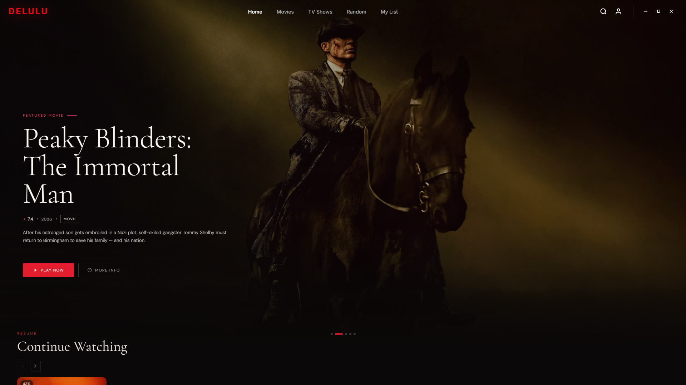
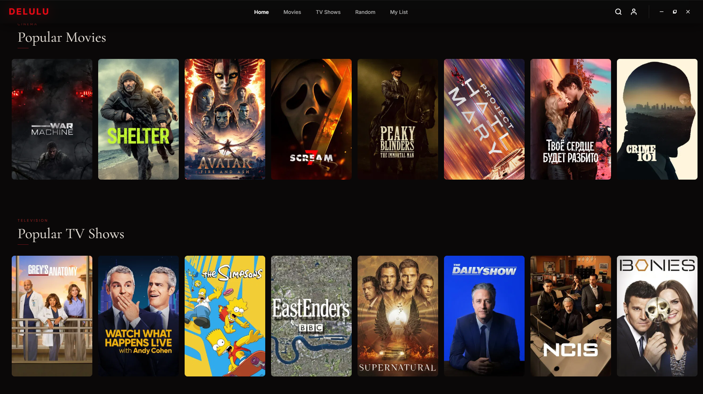
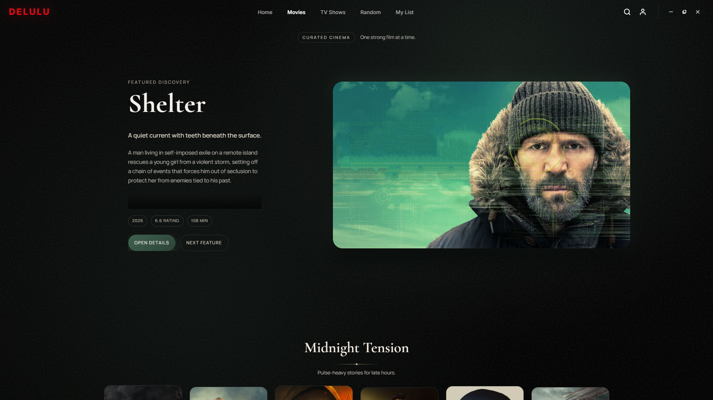
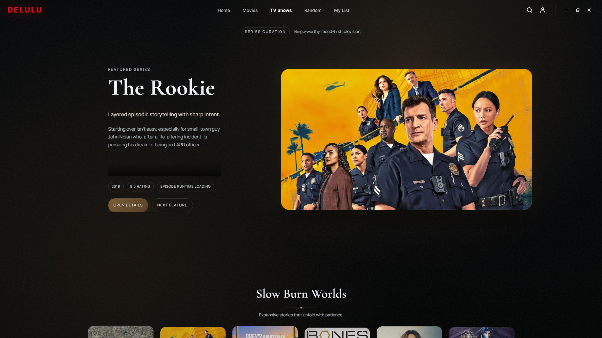
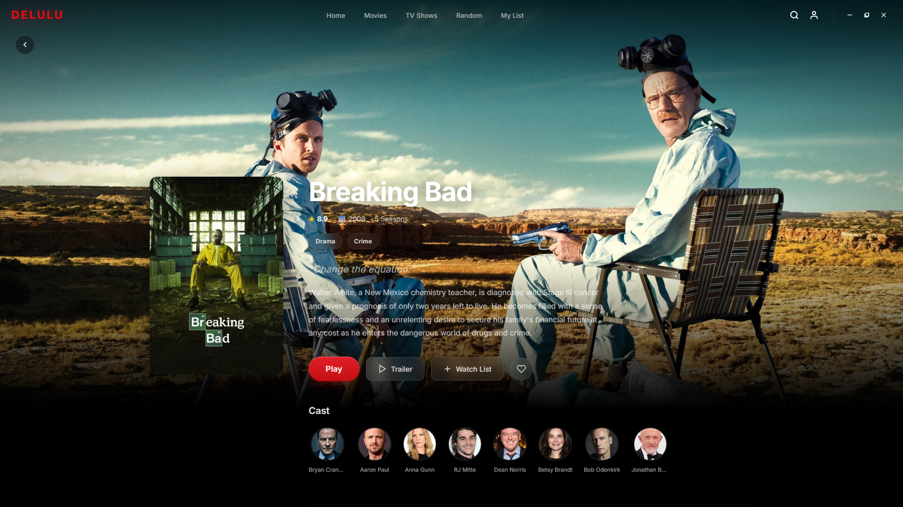
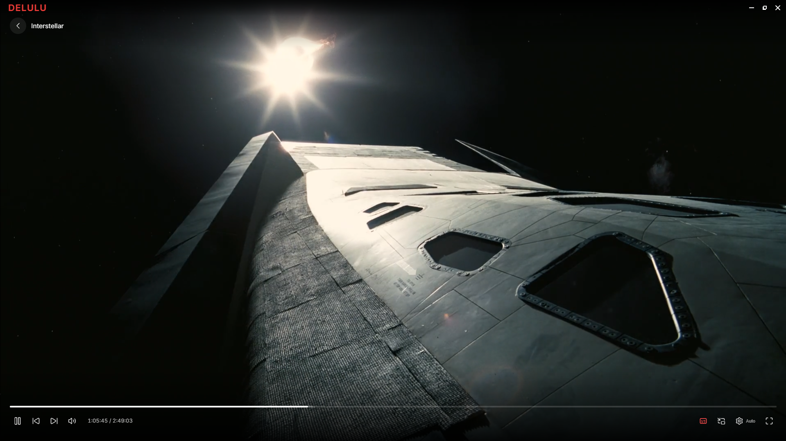
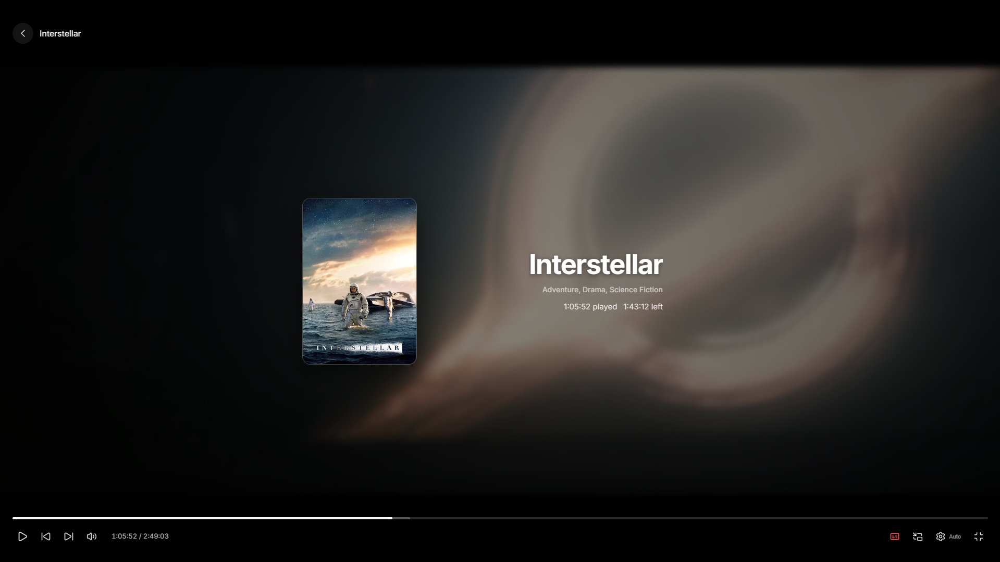

<div align="center">
  
  <h1>DeluluStream</h1>
  <p><strong>A Next-Generation, Enterprise-Grade Media Streaming Client</strong></p>
  <p>Built with Rust, Tauri, and React, featuring a resilient addon ecosystem, zero-copy proxying, and perfect CDN bypassing.</p>

  <p>
    <a href="#architecture"></a>
    <a href="#frontend"></a>
    <a href="#addons"></a>
    <a href="#license"></a>
  </p>
</div>

---

## 📸 Visual Showcase

### Home Experience
<div align="center">
  
  
</div>

### Media Discovery
<div align="center">
  
  
  
</div>

### Premium Playback Engine
<div align="center">
  
  
</div>

---

## 📖 Overview

**DeluluStream** is a highly optimized, cross-platform desktop streaming application engineered for performance, resilience, and extensibility. Bypassing traditional browser limitations, DeluluStream leverages a native **Rust backend (Tauri)** coupled with a blazing-fast **React 19 frontend** to deliver a premium, native-feeling media consumption experience.

At its core, DeluluStream implements a proprietary **Addon Engine** capable of running sandboxed binary executables via JSON-RPC, alongside native support for the broader **Stremio Community Addon** ecosystem. Coupled with an intelligent zero-copy reverse proxy, it ensures flawless playback from highly protected CDNs.

## ✨ Enterprise-Grade Capabilities

### 1. High-Performance Hybrid Architecture
- **Rust Core & Tauri Setup:** The application runs inside a heavily optimized Tauri shell (LTO, stripped symbols, panic=abort) to ensure a microscopic memory footprint and instantaneous startup times.
- **Persistent Global Player:** A custom-built React player engine (`GlobalPlayer`) that lives outside the React Router lifecycle. This guarantees that media continues playing seamlessly during UI navigation. Includes an advanced Picture-in-Picture (PiP) cinematic mini-player with drag gestures.
- **Predictive Stream Warmup:** As the app boots, it proactively pre-resolves streams for items in the "Continue Watching" queue, resulting in zero-latency playback initiation.

### 2. Advanced Addon & Resolution Engine
- **JSON-RPC Binary Addons:** Sandboxed native binaries communicate with the main process over STDIN/STDOUT, ensuring stream extraction scripts (like *MotherBox* and *EmbeGator*) run with maximum efficiency.
- **Parallel Stream Racing:** When a user requests a title, the `AddonManager` initiates a "Race Condition Resolution", querying all installed addons simultaneously. The fastest source wins immediately, while slower sources are dynamically merged into the player's source selector via background events.
- **Stremio Ecosystem Compatibility:** Out-of-the-box support for fetching manifests, resources, and aggregating streams from existing Stremio community addons.

### 3. Zero-Copy Reverse Proxy & CDN Bypass
- **MotherBox Proxy Engine:** A built-in ultra-fast Rust reverse proxy (using Hyper/Tokio) designed specifically to bypass sophisticated CDN protections.
- **Perfect Browser Fingerprinting:** Generates pristine, dynamic browser headers (`Sec-CH-UA`, exact Referer/Origin mapping) to evade anti-bot scrubbing.
- **Zero-Copy Async Streaming:** Proxies large MP4 and TS files directly to the video element without buffering them entirely into RAM. Fully supports `Range` headers for instant seeking.
- **HLS Playlist Rewriting:** Dynamically rewrites `.m3u8` manifests on the fly, intercepting all TS segment requests through the proxy via base64 encoded URL routing.

### 4. Resilient Playback & Error Recovery
- **Multi-layered Retry Logic:** Intelligent error detection that catches HLS parsing failures, 401 Unauthorized errors, and manifest probe failures, automatically falling back, refreshing credentials, and retrying up to 3 times before gracefully degrading.
- **Session-Based Audio & Subtitles:** Handles complex media objects containing dozens of audio dubs and subtitle tracks, resolving them through clean proxy URLs without needing to restart the underlying stream.

### 5. Premium UI & UX
- **Hardware-Accelerated Fluidity:** Implements `Lenis` for butter-smooth scrolling and `Framer Motion` for cinematic transitions.
- **Discord Rich Presence (RPC):** Native Rust integration to broadcast user viewing status directly to Discord.
- **Offline Resilience:** Real-time network detection with graceful degradation and cached metadata handling via local SQLite instances.

---

## 🏗️ System Architecture

```text
DeluluStream Workspace
│
├── tauri.deluluapp/         # Core Client Application
│   ├── src/                 # React 19 / TypeScript UI
│   │   ├── addon_manager/   # Addon orchestrator (Binary & Stremio)
│   │   ├── components/      # UI components, Global Player, Mini Player
│   │   ├── services/        # TMDB resolvers, Stream Adapters, SQLite
│   │   └── context/         # Global React Contexts
│   └── src-tauri/           # Rust Backend (Tauri)
│       └── Cargo.toml       # LTO & binary size optimization configs
│
├── motherbox/               # Native Binary Addon: MovieBox Resolver
│   └── src/                 # Scrapes TMDB, handles auth, dubs, and limits
│
├── motherbox-proxy/         # Standalone Rust Reverse Proxy Engine
│   └── src/                 # Zero-copy HTTP streaming, CDN fingerprint bypass
│
└── embegator/               # Native Binary Addon: VidLink & External Extractor
    └── src/                 # JSON-RPC based multi-provider extraction
```

---

## 🚀 Getting Started

### Prerequisites
- [Node.js](https://nodejs.org/) (v18+)
- [Rust](https://rustup.rs/) (1.75+)
- Platform native build tools (Visual Studio C++ Build Tools on Windows, Xcode on macOS, build-essential on Linux).

### Installation & Build

1. **Clone the repository:**
   ```bash
   git clone https://github.com/your-org/DeluluStream.git
   cd DeluluStream/tauri.deluluapp
   ```

2. **Install frontend dependencies:**
   ```bash
   npm install
   ```

3. **Configure Environment Variables:**
   Copy the `.env.example` file:
   ```bash
   cp .env.example .env
   ```
   *(Ensure you populate required keys, such as `TMDB_API_KEY`)*.

4. **Run in Development Mode:**
   ```bash
   npm run dev
   ```

5. **Build for Production:**
   This command executes a highly optimized release build using `tsc` and Vite, followed by `tauri build`.
   ```bash
   npm run build
   ```

---

## 🧩 Addon Development Protocol (JSON-RPC)

DeluluStream supports native external addons. Binaries must communicate via STDIN/STDOUT using a standard JSON-RPC 2.0 format.

**Example Request from DeluluStream:**
```json
{
  "id": 1,
  "method": "resolveStream",
  "params": {
    "mediaType": "movie",
    "tmdbId": 550,
    "season": null,
    "episode": null
  }
}
```

**Expected Response from Addon:**
```json
{
  "id": 1,
  "jsonrpc": "2.0",
  "result": {
    "success": true,
    "streamUrl": "https://secure-cdn.example/video.mp4",
    "headers": { "Referer": "https://example.com" },
    "subtitles": [
      { "url": "https://...", "language": "English" }
    ]
  }
}
```

---

## 🛡️ Security & Privacy

- **No Remote Telemetry:** All watch histories, session states, and configurations are stored completely locally via the embedded SQLite database (`tauri-plugin-sql`).
- **Sandboxed Addons:** External binaries do not have direct access to the frontend DOM or the main Tauri context. They are limited strictly to the JSON-RPC interface.
- **BHO/Extension Blocking:** On Windows, the WebView2 engine is explicitly configured (`--disable-extensions`) to block invasive software like IDM or third-party tracking toolbars from injecting into the app frame.

---

## 📄 License

This project is licensed under the **MIT License**. See the [LICENSE](LICENSE) file for details.

---
<div align="center">
  <i>Developed with ❤️ by the Delulu Team</i>
</div>
